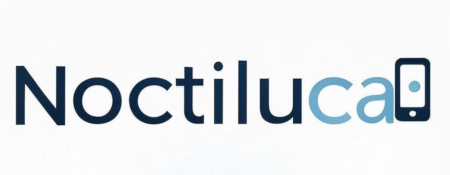

# Noctiluca

**Noctiluca** is a lightweight, mobile-first presentation system built with [**FastAPI**](https://fastapi.tiangolo.com/) and [**NiceGUI**](https://nicegui.io/). It allows multiple mobile clients to connect and view a synchronized presentation, controlled by a designated presenter. The system ensures real-time updates across all connected devices.



NOTE: this is a test project to experiment with the following topics:
 
 - The [Astral tool chain (uv and ruff)](https://astral.sh/)
 - Using [the Aider codeing assistant](https://aider.chat/)

 Alhouth the project is intended to be working and usefull, it's final usefullness is secondary to the ultimate success of the experiments.

## Features

- No need for a projector or large screen – any mobile browser can be used.
- Real-time synchronization between presenter and audience devices.
- Pluggable **Glow** modules define presentation behavior.
- Supports multiple **Projects**, each referencing a different **Glow**.
- Built with **FastAPI** and **NiceGUI** for a modern, efficient UI.

---

## Installation

### 1. Install `uv`
To use `uv` for dependency management, first install it:

```sh
pip install uv
```

To verify the installation:

```sh
uv --version
```

For more installation options and to see further documentation, [checkout uv on its home page](https://astral.sh/) or [it´s Github repository](https://github.com/astral-sh/uv).

---

### 2. Get the Source Code
Clone the Noctiluca repository:

```sh
git clone https://github.com/soyrochus/noctiluca.git
cd noctiluca
```

---

### 3. Install Dependencies (Poetry-Style with `uv`)
Instead of `poetry install`, use:

```sh
uv pip sync
```

This:
- Reads dependencies from `pyproject.toml`
- Installs them inside a virtual environment (`.venv/`)
- Ensures your environment matches the locked dependencies

To install locked dependencies only (like `poetry install --no-dev`):

```sh
uv pip sync --only-locked
```

---

### 4. Running Noctiluca
You **don’t need to manually activate the virtual environment**. Instead, run:

```sh
uv venv run python main.py
```

Alternatively, activate the virtual environment manually:

```sh
source .venv/bin/activate  # macOS/Linux
.venv\Scripts\activate     # Windows

python main.py
```

---

## Adding Dependencies

To install and add a package to `pyproject.toml`:

```sh
uv add fastapi
```

For **development dependencies**:

```sh
uv add ruff --dev
```

To update dependencies (similar to `poetry update`):

```sh
uv pip compile && uv pip sync
```

---

## Usage

1. Open the **presenter interface**:  
   ```
   http://localhost:8000/projects/<project_id>/presenter
   ```
   - Start a new show to generate a **Show ID**.
   - This **Show ID** is required for audience members to join.

2. Audience members join via:
   ```
   http://localhost:8000/projects/<project_id>
   ```
   - Enter the **Show ID**, or navigate directly to:
   ```
   http://localhost:8000/projects/<project_id>/<show_id>
   ```

3. The presenter controls slides (Next, Previous, etc.), and all connected clients update instantly.

---

## License
MIT License © 2025 Iwan van der Kleijn
See the MIT license file in this repo
